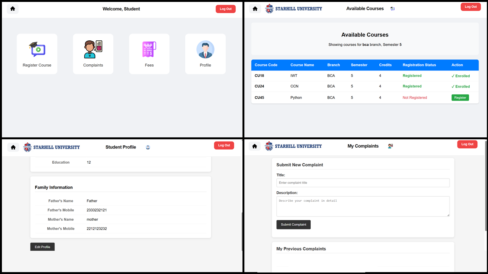
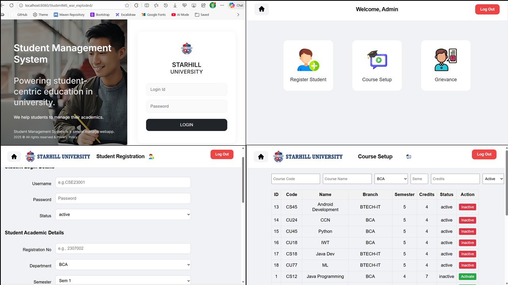

# Table of Contents
- [Student Management System](#student-management-system)
- [Features](#features)
- [Tech Stack](#tech-stack)
- [Screenshots](#screenshots)
- [Setup \& Installation](#setup--installation)
    - [1. Prerequisites](#1-prerequisites)
    - [2. Clone and setup](#2-clone-and-setup)
        - [Clone and Setup (Configuration)](#clone-and-setup-configuration)
        - [How to obtain JDBC URL (MySQL Workbench)](#how-to-obtain-jdbc-url-mysql-workbench)
    - [3. Build \& Run](#3-build--run)
        - [Run in IntelliJ IDEA](#run-in-intellij-idea)
        - [Run in Spring Tool Suite (STS)](#run-in-spring-tool-suite-sts)
    - [4. Troubleshooting](#4-troubleshooting)
- [License](#license)

---

# Student Management System

A web-based **Student Management System** built using **Advanced Java (JSP, Servlets, and JDBC)** that allows administrators to manage student records efficiently.  
This project demonstrates the integration of frontend and backend technologies for a complete CRUD-based web application.


## Features

- **Student Management** — Add, view, update, and delete student details.  
- **Course Management** — Assign and manage courses for each student.  
- **Login & Authentication** — Secure login system for admin and users.  
- **Database Connectivity** — Connected to a MySQL database using JDBC.  


---

## Tech Stack

| Category | Technology Used |
|-----------|-----------------|
| **Frontend** | HTML, CSS, JSP |
| **Backend** | Java Servlets, JDBC |
| **Database** | MySQL |
| **Server** | Apache Tomcat |
| **IDE** | IntelliJ IDEA |
| **Version Control** | Git & GitHub |

## Screenshots

| Product Images |                                                                             |
|----------------|-----------------------------------------------------------------------------|
|  |  |
| [Preview](src/main/webapp/assets/screenshot/screenshot_1.PNG) | [Preview](src/main/webapp/assets/screenshot/screenshot_2.PNG)               |


## Setup \& Installation

### 1. Prerequisites
- Install Java JDK 11 or newer and set `JAVA_HOME` (Windows).
- Install MySQL Server and optionally MySQL Workbench.
- Install Apache Tomcat 9+ (or use IntelliJ/STS bundled Tomcat).
- Install Maven or use IntelliJ's bundled Maven.
- An IDE: `IntelliJ IDEA` (preferred) or `Spring Tool Suite (STS)` or `VS Code`.

### 2. Clone and setup

#### Clone and Setup (Configuration)
```bash
git clone https://github.com/SubhamSathua/Student-Management-System.git
cd Student-Management-System
```

**Steps:**
1. Open the project in your IDE (IntelliJ / STS / VS Code).
2. Locate and edit the database connection class:
    - Open `java/dao/Env.java`.
    - Update the JDBC URL, username and password to match your MySQL setup.
    - Example JDBC URL format:

3. **How to obtain the JDBC URL using MySQL Workbench:**
    - Open `MySQL Workbench`.
    - Go to `Manage Connections` → select your connection → `View Connection Properties`.
    - Note the host, port and database name and compose the URL as shown above.
4. Create the database schema:
    - Open the SQL template file `db/stude_sys.sql` in MySQL Workbench (or any SQL client).
    - Execute the script to create tables and seed data.

### 3. Build \& Run

##### Run in IntelliJ IDEA
1. Build the project:
   ```bash
   mvn clean package
   ```
2. Open IntelliJ IDEA and import the Maven project if prompted.
3. Configure Tomcat:
    - Go to `Run` → `Edit Configurations` → click `+` → choose `Tomcat Server` → `Local`.
    - In the `Deployment` tab click `+` → `Artifact` → choose `exploded` artifact for hot-reload (recommended).
4. Ensure the artifact points to your webapp. The application entry file is:
    - `src/main/webapp/index.jsp`
5. Start the Tomcat run configuration from the Run toolbar.
6. Open a browser and visit:
   ```
   http://localhost:8080/
   ```

##### Run in Spring Tool Suite (STS)
1. Import the project as an existing Maven project: `File` → `Import` → `Existing Maven Projects`.
2. Ensure `Tomcat` is added to STS: `Window` → `Show View` → `Servers` → add new `Tomcat Server`.
3. Right-click the server → `Add and Remove...` → add your project → `Finish`.
4. Start the server (right-click → `Start`) and open:
   ```
   http://localhost:8080/
   ```

### 4. Troubleshooting
- Cannot connect to MySQL:
    - Confirm MySQL service is running.
    - Verify `Env` has correct host, port, username and password.
    - Check firewall rules or port conflicts.
- Database schema errors:
    - Ensure `db/stude_sys.sql` executed successfully and the correct database name is used in `Env`.
- JSP / Servlet errors on startup:
    - Open Tomcat logs (`<tomcat>/logs/catalina.out` or IntelliJ Run console) and read the stack trace.
    - Ensure Java package names and `web.xml` (if present) are correct.
- Port 8080 in use:
    - Change Tomcat port in server configuration or stop the conflicting service.
- If build fails with Maven:
    - Run `mvn -X clean package` to see full debug output.

## License

This project is licensed under the MIT License.  
See the [LICENSE](LICENSE) file for details.


